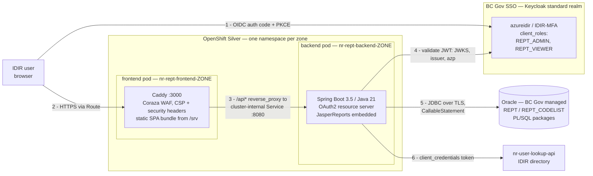
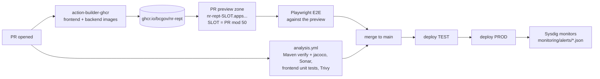

# REPT - Real Estate Project Tracking

A full-stack application for tracking real estate projects in the Natural Resources sector.

| Component | Technology |
|-----------|------------|
| Frontend | React 19, TypeScript, Carbon Design System |
| Backend | Spring Boot 3.5, Java 21 |
| Database | Oracle (shared, BC Gov-managed) |
| Auth | BC Gov SSO (Keycloak), administered through CSS |
| Reports | JasperReports library (embedded, no remote server) |

## Architecture



**How a request flows.** The browser authenticates directly against Keycloak (`oidc-client-ts`, auth code + PKCE) and holds the access token; `buildAuthorizedHeaders` (`frontend/src/services/http/headers.ts`) attaches it as a `Bearer` header on every `/api` call — renewing first if the five-minute access token is near expiry — alongside Spring Security's `X-XSRF-TOKEN` for state-changing requests. Caddy serves the SPA and reverse-proxies `/api*` to the backend Service — the backend has **no Route**, so the only path to it is through the frontend pod (enforced by a NetworkPolicy that admits the same-zone frontend pod and cluster monitoring, nothing else). Spring Security validates the token as an OAuth2 resource server: signature against the realm JWKS, issuer, and `azp` matching `KEYCLOAK_CLIENT_ID` — the last one matters because the standard realm is shared by many BC Gov apps, so signature and issuer alone don't prove a token was minted for REPT. Roles come from the `client_roles` claim and gate endpoints as `REPT_ADMIN` / `REPT_VIEWER`.

**Data access.** There is no ORM over the business tables and no schema DDL in this repo. Repositories under `backend/.../repository/rept` call PL/SQL packages (`REPT`, `REPT_CODELIST`) through `JdbcTemplate` + `CallableStatement`; the procedure signatures live in the database, not here. Reports are `.jrxml` templates in `backend/src/main/resources/reports`, compiled and cached in-process by `ReptReportService` and filled against the same Oracle connection — JasperReports is a library, there is no report server.

**Config and images.** One image per component serves every zone. The Vite bundle is env-agnostic; `docker-entrypoint.sh` writes `VITE_*` values into `/srv/config.js` at container start, so DEV preview, TEST and PROD run the same binary with different runtime config.



`pr-close.yml` tears the preview zone down on close, and passes an explicit `cleanup_name` because the objects are labelled `app=nr-rept-{backend,frontend}-<PR>` rather than the helper's default.

PR previews share a fixed pool of 50 pre-registered hostnames because redirect URIs had to be enumerated under Cognito. Redirect URIs now live on the CSS integration; if CSS accepts a wildcard, the bucketing in `frontend/openshift.deploy.yml` can go away.

## Local Development

Two supported ways to run REPT locally. Pick whichever fits your workflow.

| | Option A — direct on host | Option B — Docker Compose |
|---|---|---|
| **Backend hot reload** | Manual restart (no spring-boot-devtools) | Manual restart |
| **Frontend hot reload (Vite HMR)** | Yes | Yes |
| **First-time setup cost** | Install Java 21 + Node 22 on host | Just Docker Desktop |
| **Best for** | Day-to-day backend dev where you re-`mvn` often | Quick smoke tests, frontend-only work |

Both options share the same prerequisites and property files below — only the launch step differs.

### Shared prerequisites

1. **BC Gov VPN connected.** The backend needs to reach the BC Gov Oracle host configured in `application-local.yml`; Compose can't route that for you.
2. **Maven 3.9+ and Java 21** (Option A only). The repo has no Maven wrapper.
3. **Node 22+** (Option A only).
4. **Docker Desktop** (Option B only).

### Property files you create once

These are all gitignored — you set them up once and they stay on your machine.

#### `backend/src/main/resources/application-local.yml`

Activated by the Spring `local` profile. Holds DB credentials, the Keycloak issuer URI and client id, the nr-user-lookup-api settings (`ca.bc.gov.nrs.user-lookup.*` — see [backend/README.md](backend/README.md)), and `TRUSTSTORE_PATH`. The header comment in that file documents every field. Copy from a teammate or from the `oc cp` template in the file's comment block.

The user-lookup block is optional locally: leave `base-url`/`token-url`/`client-id`/`client-secret` blank and the app starts fine — the "Find user" search just returns nothing.

Note for Option B: the absolute `TRUSTSTORE_PATH` you set here is overridden inside Docker to `/app/src/main/resources/cert/jssecacerts` via compose env — no edit needed.

#### `backend/src/main/resources/cert/jssecacerts`

Java keystore containing the trusted CA chain for the Oracle TLS connection. Copy from a running pod (one-liner is in the `application-local.yml` comment block):

```bash
mkdir -p backend/src/main/resources/cert
oc cp $(oc get pod -l app=rept-backend -o jsonpath='{.items[0].metadata.name}'):/cert/jssecacerts backend/src/main/resources/cert/jssecacerts
```

#### `frontend/.env`

Copy `frontend/.env.example` and fill in the Keycloak settings. `VITE_KEYCLOAK_URL`, `VITE_KEYCLOAK_CLIENT_ID`, `VITE_BACKEND_URL` and `VITE_APP_NAME` are inlined into the app bundle by Vite (via `import.meta.env`); changing `.env` requires restarting `npm run dev`. For local dev, `http://localhost:3000/authCallback` must be a registered redirect URI on the CSS integration, and `http://localhost:3000` a registered post-logout URI.

### Option A — direct on host (recommended for backend work)

Two terminal tabs. Backend in one, frontend in the other.

**Backend:**

```bash
cd backend
mvn -DskipTests spring-boot:run -Dspring-boot.run.profiles=local,oracle
```

Listens on `http://localhost:8080`. Health: `http://localhost:8080/actuator/health`.

For a Java code change, hit Ctrl-C and re-run. If you want true hot reload, add `spring-boot-devtools` to `backend/pom.xml` — not in there by default.

**Frontend:**

```bash
cd frontend
npm ci
npm run dev
```

Vite serves at `http://localhost:3000`. HMR is on; save a `.tsx` file and the browser auto-refreshes. `/api/*` requests proxy to `http://localhost:8080` via Vite's dev proxy (configured in `vite.config.ts`).

### Option B — Docker Compose

```bash
docker compose up           # foreground; Ctrl-C to stop
docker compose up -d        # detached
docker compose down         # stop containers, keep cache
docker compose down -v      # stop + drop the Maven cache volume
docker compose logs -f backend
```

Services:
- `backend` → `localhost:8080` (Spring Boot via `mvn spring-boot:run` inside `maven:3.9.9-amazoncorretto-21-alpine`).
- `frontend` → `localhost:3000` (Vite via `npm run dev` inside `node:22-alpine`).

First `up` downloads the Maven dependency graph (~3–5 min) into the `maven-cache` named volume. Subsequent `up`s are fast.

An optional production-like frontend variant is on the `caddy` profile:

```bash
docker compose --profile caddy up caddy backend
```

That builds the real `frontend/Dockerfile` (Caddy + Coraza WAF + runtime config.js seeding) and serves it at `localhost:3005`. Useful for reproducing prod CSP/header behaviour before pushing.

#### Compose-specific gotchas

- If you Ctrl-C mid–dependency-download, you can end up with zero-byte POMs in the `maven-cache` volume and Maven will refuse to start with `Non-readable POM ... input contained no data`. Fix: `docker compose down -v && docker compose up`.
- The backend is **not** hot-reloading. Java changes need `docker compose restart backend`.
- HMR uses WebSocket from your browser back to `localhost:3000`. If you remap the published port, also override `VITE_HMR_PORT` in `compose.yml`.

### Verifying it works

Regardless of option:
- `curl http://localhost:8080/actuator/health` → `{"status":"UP"}`
- Open `http://localhost:3000` → app loads, IDIR login round-trips through Keycloak and returns via `/authCallback`.

If `/actuator/health` returns `DOWN`, the most likely cause is the Oracle connection — check VPN, `application-local.yml` credentials, and the truststore path.

## Component docs

- [backend/README.md](backend/README.md) — Spring profile reference, env-var table, API endpoints, test commands.
- [frontend/README.md](frontend/README.md) — Vite scripts, env-var table, project structure, testing libraries.
